# Canary-Deployment with argo-rollout
A Practical on Canary deployment using argo-rollout      
Canary Deployemt is a DevOps sofware release stategy for releasing a newer version of software to a few group of users initially for a short period time while every other user can come in afterwards.
Canary deployment can be performed with istio and argo-rollout but for the sake of this practical, I will be demonstrating it with argo-rollout

- [*] Create EKS-Cluster and install:[awscli, Terraform, kubectl and eksctl]

- [*] install Argo Rollout on EKS Cluster

```
kubectl create namespace argo-rollouts

kubectl apply -n argo-rollouts -f https://github.com/argoproj/argo-rollouts/releases/latest/download/install.yaml

kubectl apply -n argo-rollouts -f https://github.com/argoproj/argo-rollouts/releases/latest/download/dashboard-install.yaml 

```
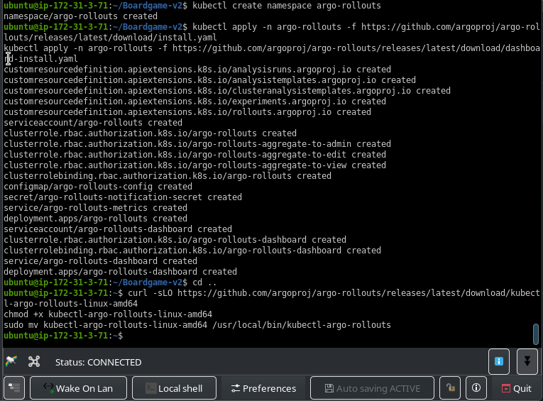

**edit the svc to see the dashboard** `kubectl edit svc <svc-name-dashboard> -n argo-rollouts` to a LoadBalancer type

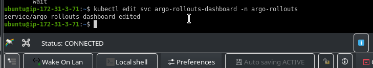

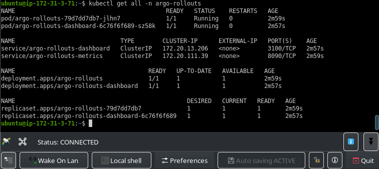

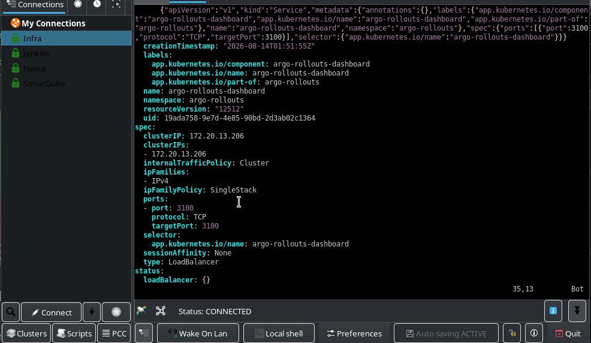

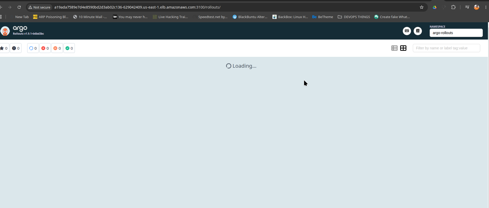

> Since the boardgame is a java application developed with jda17, then we have to install jdk17: `sudo apt install openjdk-17-jre-headless` Maven: `sudo apt install maven` so as to be able to compile and create a jar file.  `mvn clean package` . alson install docker `sudo apt install docker.io` so as to be able to build and ship 
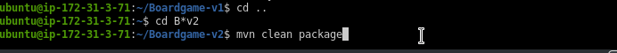

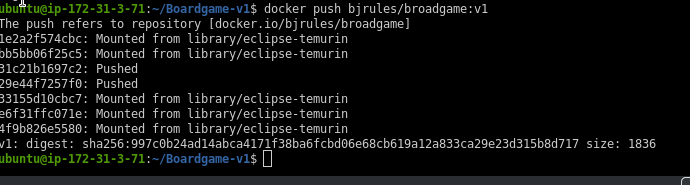

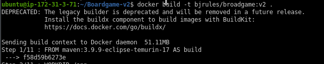

`docker login -u bjrules` to login to dockerhub so as to enable docker push

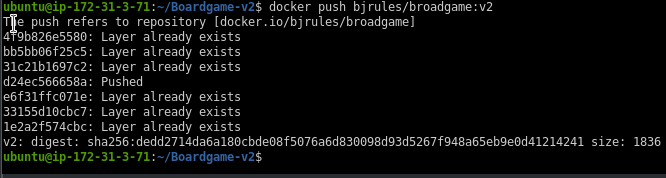

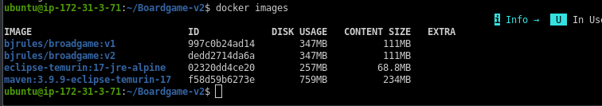

> install the Plugin kubectl-argo-rollouts so as to be able to use the `kubectl-argo-rollouts` commands

```
curl -sLO https://github.com/argoproj/argo-rollouts/releases/latest/download/kubectl-argo-rollouts-linux-amd64
chmod +x kubectl-argo-rollouts-linux-amd64
sudo mv kubectl-argo-rollouts-linux-amd64 /usr/local/bin/kubectl-argo-rollouts

```

**In the Boardgame I modified the index.html page in src/main/resources/templates and created another one see code below; so as to simulate v2**

```
<!DOCTYPE html>
<html lang="en" xmlns:th="http://www.thymeleaf.org"
    xmlns:sec="https://www.thymeleaf.org/thymeleaf-extras-springsecurity5" data-bs-theme="light">

<head th:replace="fragments/header.html :: html-head(title='Boardgame Home')"></head>

<style>
    .canary-banner {src/main/resources/templates
        background: linear-gradient(90deg, #00c9ff 0%, #92fe9d 100%);
        color: #004d40;
        font-weight: bold;
        text-align: center;
        padding: 12px;
        font-size: 1.2rem;
        box-shadow: 0 2px 5px rgba(0,0,0,0.1);
    }
    .game-card {
        transition: transform 0.3s, box-shadow 0.3s;
        border-radius: 10px;
        padding: 20px;
        background-color: #f8f9fa;
        box-shadow: 0 2px 6px rgba(0,0,0,0.1);
    }
    .game-card:hover {
        transform: scale(1.03);
        box-shadow: 0 4px 12px rgba(0,0,0,0.2);
    }
    .badge-new {
        font-size: 0.75rem;
        background-color: #ffc107;
        color: black;
        padding: 3px 8px;
        border-radius: 10px;
        margin-left: 10px;
    }
    .top-picks {
        background: #fff3cd;
        border: 1px solid #ffeeba;
        border-radius: 10px;
        padding: 20px;
    }
    .v2-footer {
        text-align: center;
        font-size: 14px;
        color: white;
        background: rgba(0, 0, 0, 0.7);
        padding: 10px;
        position: relative;
        bottom: 0;
        width: 100%;
    }
</style>

<body>
    <div class="canary-banner">
        🚀 Welcome to <strong>BoardGame v2</strong> – Canary Release with New Features!
    </div>

    <nav th:replace="fragments/links :: nav.navigation-links"></nav>

    <main class="container py-4">
        <div class="text-center mb-5">
            <h1 class="display-5 fw-bold">🎲 Explore the Latest Boardgames</h1>
            <p class="lead text-muted">Discover new experiences added in v2</p>
        </div>

        <div id="error" class="error pt-3 text-center">
            <div th:if="${userAddedMsg}">
                <p th:text="${userAddedMsg}" class="alert alert-info"></p>
            </div>
        </div>

        <div th:unless="${boardgames.empty}" class="row g-4">
            <div class="col-md-4" th:each="boardgame : ${boardgames}">
                <div class="game-card h-100 text-center">
                    <h4 th:text="${boardgame.name}">Game Name</h4>
                    <span class="badge-new" th:if="${boardgame.name.contains('X')}">NEW</span>
                    <a th:href="@{|/${boardgame.id}|}" class="btn btn-outline-primary mt-3">View Details</a>
                </div>
            </div>
        </div>

        <div th:if="${boardgames.empty}" class="text-center">
            <p class="text-muted">Currently there is no boardgame database available.</p>
        </div>

        <div sec:authorize="!hasRole('ROLE_USER')" class="text-center mt-4">
            <p class="lead">For more services, login <a href="#" th:href="@{/login}">Here</a></p>
            <p class="lead">To join the service, <a href="#" th:href="@{/newUser}">Click</a> here</p>
        </div>

        <div sec:authorize="hasRole('ROLE_USER') || hasRole('ROLE_MANAGER')" class="text-center mt-4">
            <p class="lead">Click <a href="#" th:href="@{/secured/addBoardGame}">Here</a> to add a boardgame!</p>
            <form th:action="@{/logout}" method="post">
                <input type="submit" value="Logout" class="btn btn-danger mt-2">
            </form>
        </div>

        <!-- Top Picks Section -->
        <section class="top-picks mt-5">
            <h3 class="text-center mb-3">🔥 Top Picks This Week</h3>
            <div class="d-flex justify-content-around flex-wrap">
                <div>🎯 <strong>Codenames</strong></div>
                <div>🧠 <strong>Azul</strong></div>
                <div>🛡️ <strong>Carcassonne</strong></div>
                <div>🌍 <strong>Ticket to Ride</strong></div>
            </div>
        </section>
    </main>

    <div th:include="fragments/links :: div.bottom-links"></div>
    <div th:replace="fragments/footer.html :: page-footer"></div>

    <div class="v2-footer">
        ⚡ You are viewing version 2.0 (Canary)
    </div>
</body>

</html>


```

**Now create the Custom Resource Definition CRD in kubernetes called Rollout**
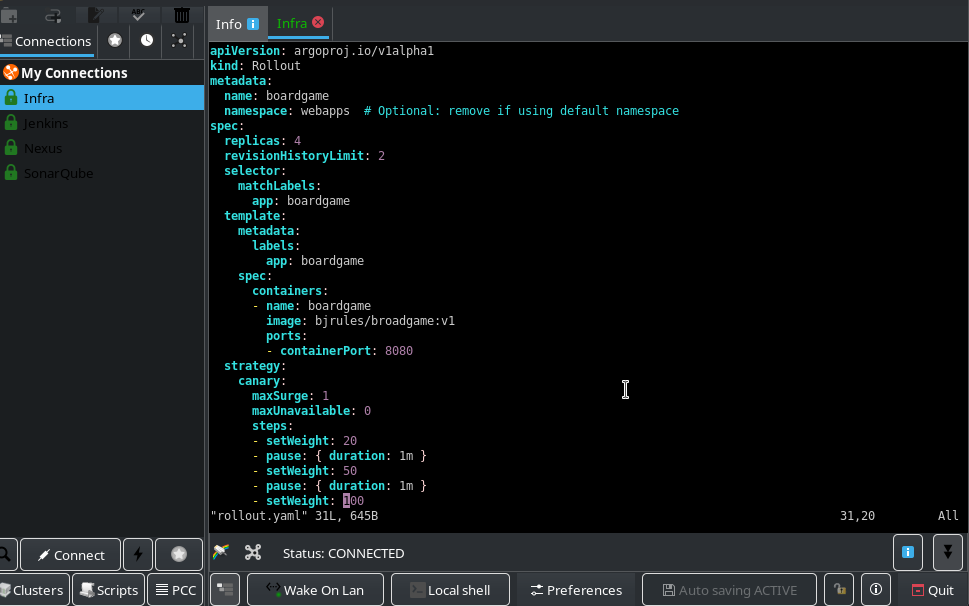

**Create Service**
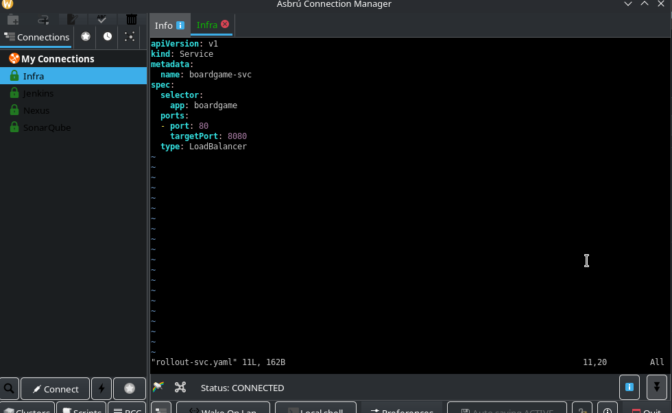

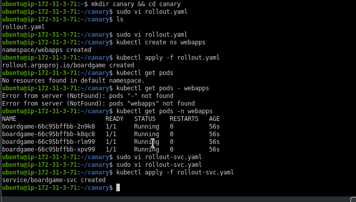

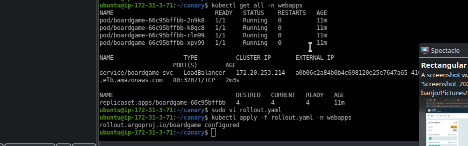

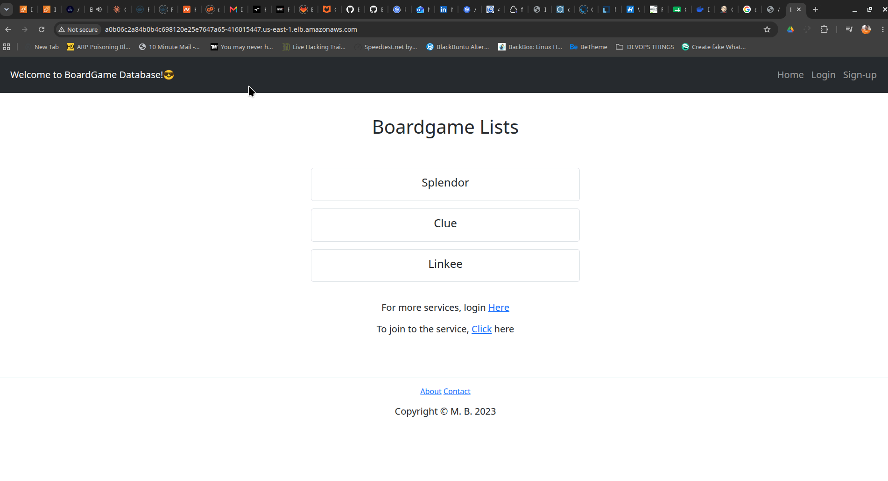

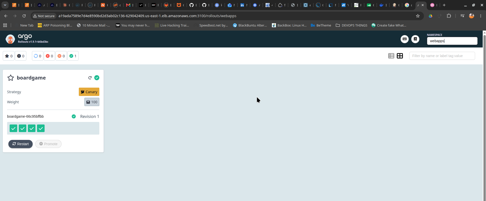

**Modify the image to v2 by editing the rollout.yaml file or use the command `kubectl-argo-rollouts set image boardgame boardgame=bjrules/broargame:v2 -n webapps`

>dashbord responds accordingly
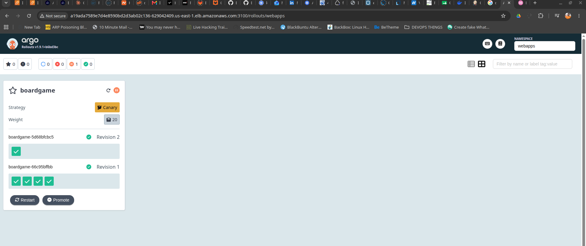

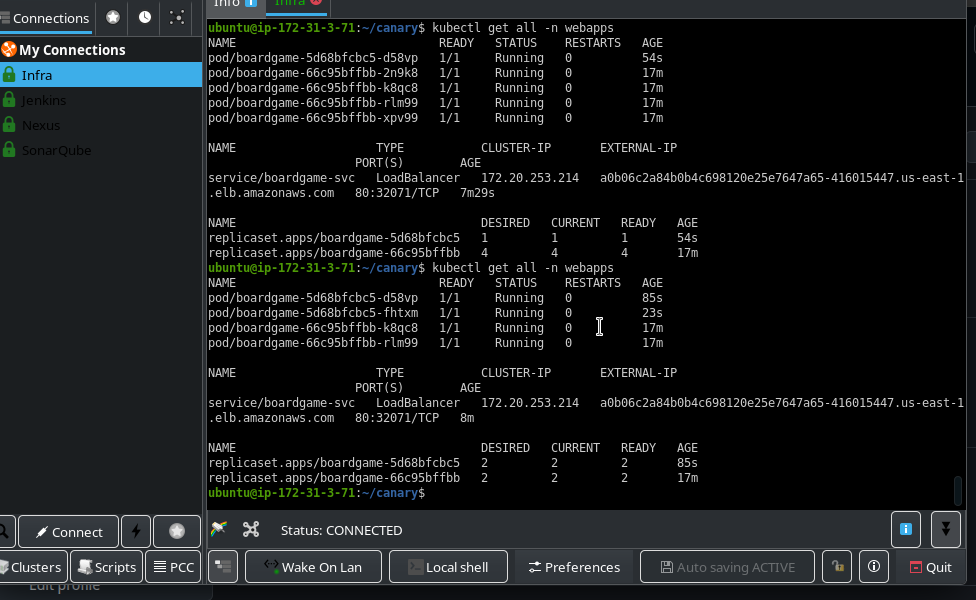

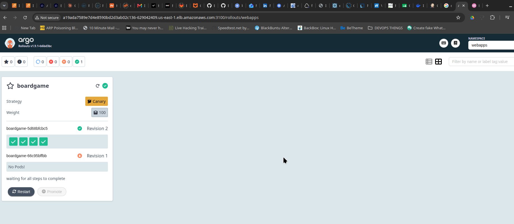

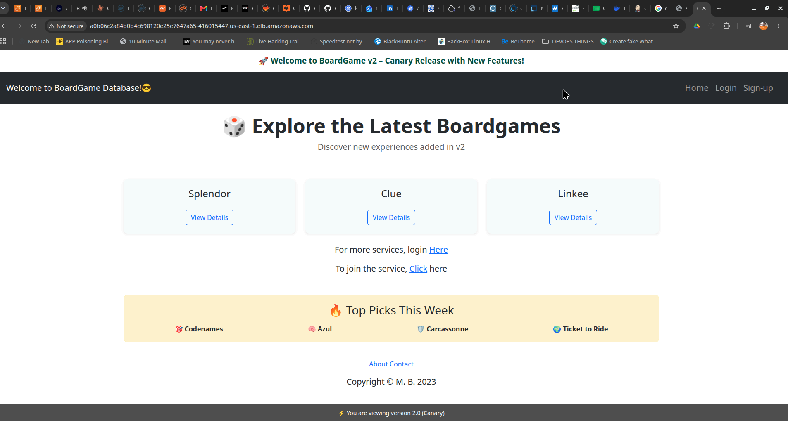